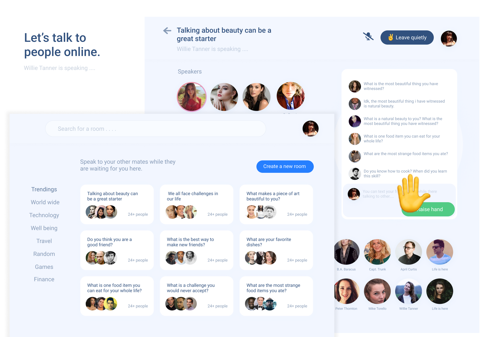
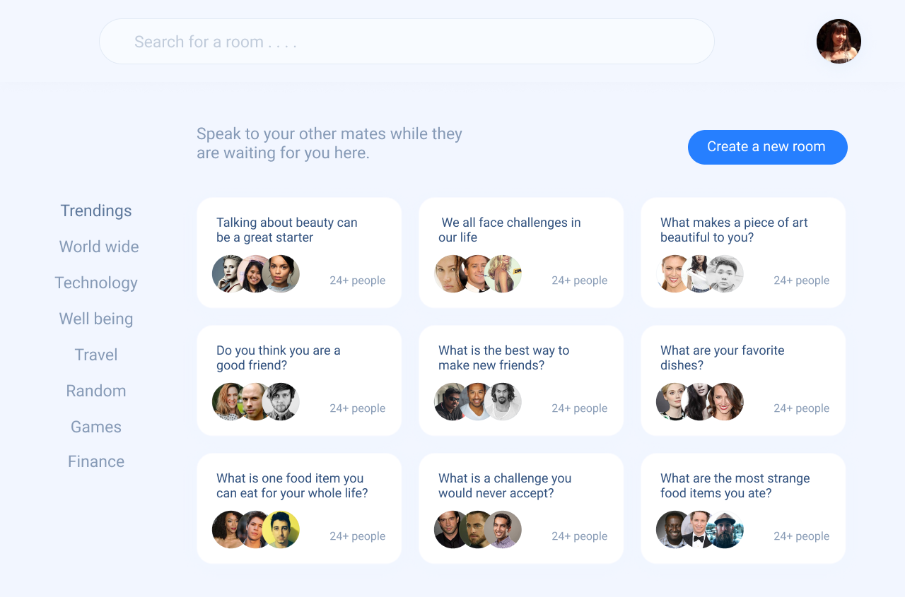
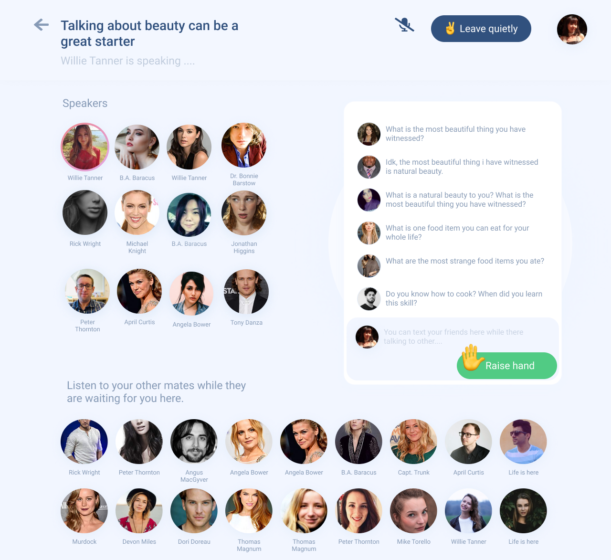
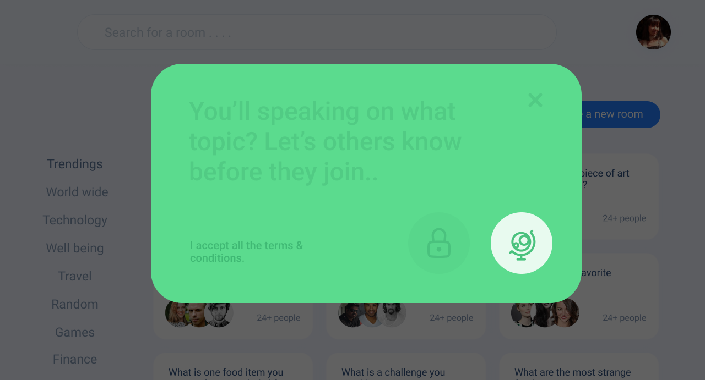
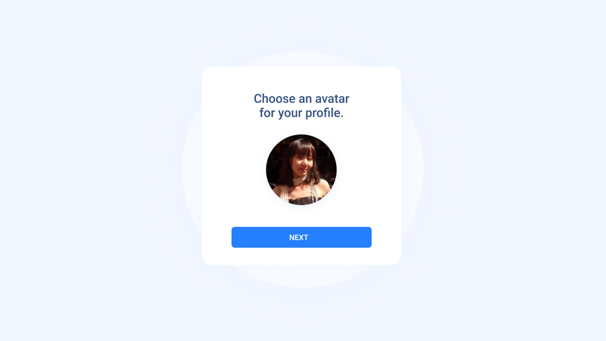

# Speak-out
Speak-out is a new type of social network based on voice—where people around the world come together to talk, listen and learn from each other in real-time.
Design files can be found here https://www.figma.com/file/W30weyq49fCPvj35uQkRT6/Speak-out?node-id=0%3A1

### Other screens

